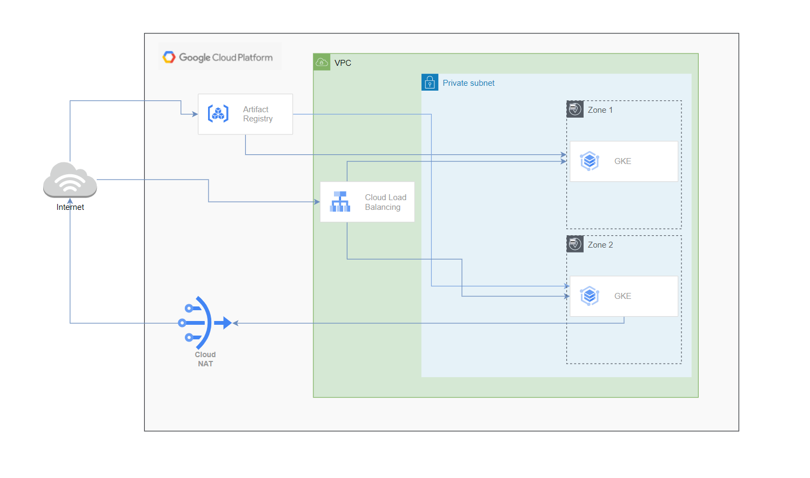

**A GKE cluster within a VPC with 2 Availability Zones:**

This Terraform example builds a GKE cluster that resides within a subnet which belongs to a VPC. To achieve high availability, the clusters are created in two availability zones.

The terraform script is divided into 3 modules:

`	`**Network:** this module creates the VPC, Cloud Nat, Cloud Router, Private Subnet.

`	`**GKE:** this module creates the GKE cluster, the HTTP Load Balancer.

`	`**AR:** this module creates the Artifcat Registry repository 

Nodes on the GKE cluster cannot be reached directly from public internet. However, they can reach internet by passing through Cloud Nat.

**Variables:**

|**Name**|**Description**|**Required**|**type**|**Default value**|
| :-: | :-: | :-: | :- | :- |
|project\_name|GCP project ID|✓|string||
|Credentiels\_name|Name of service account json file|✓|string||
|Project\_region|Region of the GCP project|✓|string||
|gke\_service\_account|Name of the service account of the default compute engine|✓|string||
|vpc\_name|Name of the VPC|✓|string||
|repo\_location|Artificat registry repo location|✓|string||
|repo\_id|Artificat registry repo name|✓|string||

**Perquisites:**

A service account that has permissions to create different resources.** 

**How to run this script?**

- [terraform init](https://registry.terraform.io/modules/terraform-google-modules/kubernetes-engine/google/21.2.0#terraform%20init) to get the plugins
- [terraform plan](https://registry.terraform.io/modules/terraform-google-modules/kubernetes-engine/google/21.2.0#terraform%20plan) to see the infrastructure plan
- [terraform apply](https://registry.terraform.io/modules/terraform-google-modules/kubernetes-engine/google/21.2.0#terraform%20apply) to apply the infrastructure build
- [terraform destroy](https://registry.terraform.io/modules/terraform-google-modules/kubernetes-engine/google/21.2.0#terraform%20destroy) to destroy the built infrastructure

**Deploying an application to GKE cluster:**

**Perquisites:**

GCloud and kubectl installed if you are running in a local env.

**How to deploy an application :**

We a provide an example of an application deployment to GKE.

After creating the infrastructure with terraform, we launch the script deploy_app.sh to deploy the application to the GKE cluster.
```
bash deploy_app.sh CLUSTER\_NAME LOCATION volume_file_name.yaml deployment_file_name.yaml 
```
PS: CLUSTER_NAME = project_name-gke
```
bash deploy_app.sh test-757ec-gke europe-west9 volumes.yaml deployement.yaml.
```
To destroy the application: 
```
bash destroy_app.sh test-757ec-gke-1 europe-west9
```


